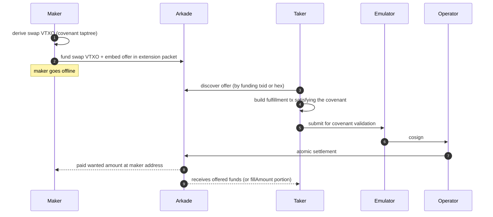

# Banco

Banco is a **non-interactive swap protocol on [Arkade](https://arkadeos.com)**. A
maker publishes a swap offer and goes offline; any taker can fulfill it
asynchronously. Atomic settlement is enforced by an Arkade-script covenant
on the maker's VTXO — no signature from the maker is required at spend time.

Banco supports BTC ↔ asset, asset ↔ BTC, and asset ↔ asset swaps, with
optional partial fills via a price-ratio covenant.

## Why non-interactive

Conventional atomic-swap constructions (HTLC, scriptless scripts, PTLC) need
both counterparties online at the same time. Banco moves the swap predicate
into a covenant on the maker's VTXO so that the maker's only action is to
fund and walk away. A taker can later spend that VTXO if — and only if —
their transaction pays the maker the wanted amount in the wanted asset, in
the same Arkade transaction that releases the maker's funds.

## Participants and trust model

| Party | Role | Trust |
|---|---|---|
| **Maker** | Publishes an offer, funds the swap VTXO, goes offline. | Trustless. |
| **Taker** | Discovers an offer and submits a fulfillment. | Trustless. |
| **Operator** | Runs the Arkade infrastructure and cosigns the fulfillment. | Liveness only — cannot steal or redirect funds. |
| **Emulator** | Validates the covenant at fulfillment time and cosigns. | Liveness only — the covenant is enforced by Arkade script regardless of who validates. |

No party custodies the maker's funds. The covenant binds the spending
transaction to pay the maker a specific amount of a specific asset to a
specific scriptPubKey. The Operator or Emulator can refuse to cosign
(denial of service) but cannot redirect funds.

## Protocol overview



1. **Offer creation.** The maker computes a covenant script over
   `(wantAsset, wantAmount, makerPkScript, optional ratio)` and derives the
   swap VTXO taptree.
2. **Funding.** The maker sends the offered funds to the swap address. The
   offer's TLV record is embedded in the funding transaction's Arkade
   extension packet (type `0x03`), making it discoverable from the txid
   alone.
3. **Discovery.** A taker either receives the offer hex out-of-band or
   reads it from the funding transaction's extension packet.
4. **Fulfillment.** The taker selects inputs from their own wallet, builds
   a transaction that satisfies the covenant (output 0 / output 1 must pay
   the maker the wanted amount; for partial fills, the remainder is
   rebound to the swap address), and submits it through the Emulator
   and the Operator.
5. **Settlement.** Atomic, in a single Arkade transaction: the maker
   receives the wanted amount; the taker receives the offered funds (or
   their `fillAmount` portion).

### Cancellation and exit

If `cancelDelay` is set, the maker can reclaim the locked funds via the
CLTV cancel leaf after the timelock expires. If `exitTimelock` is set, the
maker can unilaterally exit on-chain via the CSV exit leaf after a
relative timelock.

## Covenant script

The fulfill leaf is an [Arkade
script](https://docs.arkadeos.com/experimental/arkade-compiler) embedded
in a taproot leaf of the swap VTXO. It uses introspection opcodes to
enforce that the fulfillment transaction pays the maker, without requiring
a maker signature at spend time.

### Full-fill script

Verifies two conditions on the fulfillment transaction:

1. **Value check** — `INSPECTOUTPUTVALUE(0) >= wantAmount`.
2. **Destination check** — `INSPECTOUTPUTSCRIPTPUBKEY(0) == makerPkScript`.

For asset swaps (`wantAsset` set), `FINDASSETGROUPBYASSETID` +
`INSPECTOUTASSETLOOKUP` replace the value check to verify that the correct
asset is delivered with the required amount.

### Partial-fill script

When `ratioNum` and `ratioDen` are set, the covenant accepts any fill
amount `x` and computes the price as `consumed = x * ratioNum / ratioDen`.
The fulfillment transaction MUST:

- Pay the maker `x` of the wanted asset at output 1.
- If `consumed >= inputAmount` — **full fill**: output 0 carries the
  entire remaining input value to the maker.
- Otherwise — **partial fill**: output 0 re-creates the swap VTXO with
  `inputAmount - consumed` left in escrow, preserving the same covenant
  and scriptPubKey for future takers.

The three combinations (BTC↔asset, asset↔BTC, asset↔asset) each have a
dedicated covenant script; see `src/offer.ts`.

### VTXO taptree

| Leaf | Spendable by | Condition |
|---|---|---|
| **Fulfill** | Any taker | Covenant + Emulator cosign + Operator cosign |
| **Cancel** *(optional)* | Maker + Operator | `CLTV(cancelDelay)` reached |
| **Exit** *(optional)* | Maker + Operator | `CSV(exitTimelock)` reached |

## Wire format

Offers are a sequence of TLV records (`type: 1B | length: 2B BE | value`),
wrapped in an Arkade extension packet of type `0x03`.

| Type | Field | Encoding | Required |
|---|---|---|---|
| `0x01` | `swapPkScript` | raw scriptPubKey | ✓ |
| `0x02` | `wantAmount` | uint64 BE (sats or asset units) | ✓ |
| `0x03` | `wantAsset` | serialized `AssetId` | for asset wants |
| `0x04` | `cancelDelay` | uint64 BE (unix timestamp) | optional |
| `0x05` | `makerPkScript` | raw scriptPubKey (34B) | ✓ |
| `0x07` | `makerPublicKey` | x-only pubkey (32B) | when cancel or exit is set |
| `0x08` | `emulatorPubkey` | x-only pubkey (32B) | ✓ |
| `0x09` | `ratioNum` | uint64 BE | partial fills |
| `0x0a` | `ratioDen` | uint64 BE | partial fills |
| `0x0b` | `offerAsset` | serialized `AssetId` | for asset offers |
| `0x0c` | `exitTimelock` | 1B type (0=blocks, 1=seconds) + uint64 BE | optional |

Decoders MUST reject unknown TLV types — parsing is strict, not
forward-compatible. New types defined in future revisions of this spec
will require decoders to be updated before they can process offers that
include them.

## Usage

### Installation

```sh
pnpm add @arkade-os/banco
```

### Maker — publish an offer

```ts
import { Maker } from "@arkade-os/banco";

const maker = new Maker(wallet, arkServerUrl, emulatorUrl);

const { offer, swapPkScript, packet } = await maker.createOffer({
  wantAmount: 10_000n,   // 10k sats
  cancelDelay: 86_400,   // cancellable after 24h
});

// Fund the swap VTXO. Embedding `packet` as an extension output makes the
// offer discoverable by the funding txid alone.
await wallet.send({
  address: ArkAddress.fromPkScript(swapPkScript).encode(),
  amount: 0,
  assets: [{ assetId, amount: 1000 }],
  extensions: [packet],
});

// `offer` (hex) can also be shared out-of-band.
```

### Maker — partial fills

```ts
const { offer } = await maker.createOffer({
  wantAmount: 0n,
  wantAsset,
  ratioNum: 1_000n,   // price: 1000 sats per
  ratioDen: 1n,       //         1 asset unit
});
```

### Taker — fulfill an offer

```ts
import { Taker } from "@arkade-os/banco";

const taker = new Taker(wallet, arkServerUrl, emulatorUrl);

// Full fill from a hex offer
const { txid } = await taker.fulfill(offerHex);

// Or read the offer from the funding txid (extension packet on the fly)
const { txid } = await taker.fulfillByTxid(fundingTxid);

// Partial fill
const { txid } = await taker.fulfill(offerHex, { fillAmount: 250n });
```

### Maker — cancel

```ts
const arkadeTxid = await maker.cancelOffer(offerHex);
```

Spends the swap VTXO back to the maker via the CLTV cancel leaf. Fails if
the offer has no cancel path or if the timelock hasn't expired.

### Query offer status

```ts
const offers = await maker.getOffers(swapPkScript);
// [{ txid, vout, value, assets, spendable }]
```

## Supported swaps

| Maker offers | Maker wants | Partial fills |
|---|---|---|
| Asset | BTC | ✓ |
| BTC | Asset | ✓ |
| Asset A | Asset B | ✓ |

## Development

```sh
git clone --recurse-submodules <this repo>   # arkade-regtest is a submodule
pnpm install
pnpm lint
pnpm test          # unit tests (excludes test/e2e)
pnpm build
```

### End-to-end tests

E2E tests run against a local regtest stack: nigiri + arkd (matching ts-sdk's
config) + emulator v0.0.1.

```sh
pnpm regtest:start   # bring up nigiri, arkd, emulator
pnpm test:e2e        # run test/e2e/*
pnpm regtest:stop    # tear down (preserves volumes)
pnpm regtest:clean   # tear down + wipe volumes
pnpm regtest         # clean + start
```

`regtest/` is the [arkade-regtest](https://github.com/ArkLabsHQ/arkade-regtest)
submodule. Overrides for the arkd image, fees, and Bitcoin Core config live
in `.env.regtest`. The emulator is layered on top via
`docker-compose.emulator.yml`.

## License

[MIT](LICENSE)
